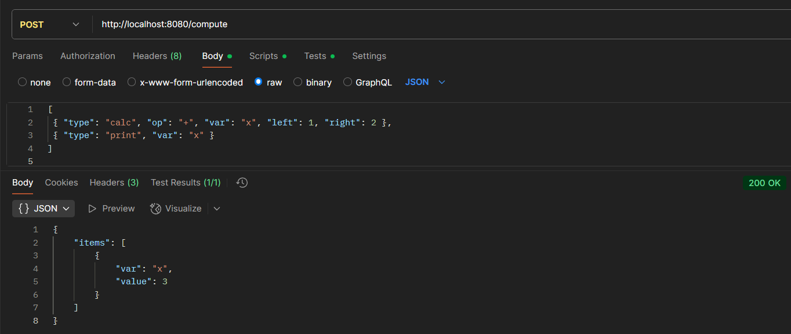
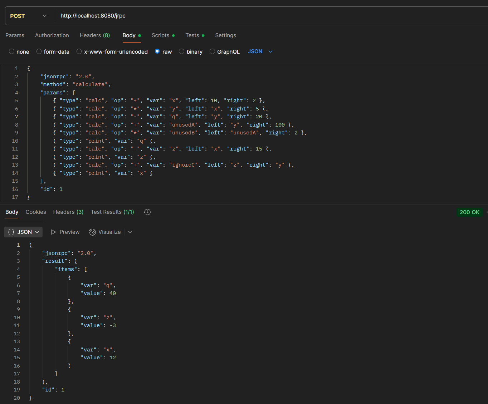

# Вычислятор

## Реализация

### Основная логика работы сосредоточена в фале `calculator.go`

`variables` (sync.Map) - вычисленные значения переменных

`printOrder` ([]string) - список пеерменных в порядке, в котором требуется вывести их значения

`commandByVar` (map[string]*Command) - словарь для поиска команд для вычисления переменной

Алгоритм работы:
Для каждой переменной в `printOrder`:
- Если значение уже вычислено в `variables`, оно используется для вывода
- Если значение отсутствует:
1. Вычисляется соответствующая команда `calc`
2. Если левый операнд - число, то используется как есть. Иначе запускается вычисление значения переменной
3. Аналогично и для правого операнда
4. Выбирается математическая операция для расчета значения
5. Результат сохраняется в `variables`

### Структура данных определена в `models.go`
`Command` - описывает формат входных инструкций
`Item` - результат: имя переменной и ее значение
`Output` - формат выходных данных

### Способы взаимодействия определены в `handler.go`
- grpc
- http endpoint

### Ядро сервера - `main.go`
Запускает HTTP-сервер на 8080 порту и дает доступ к API

## Примеры запросов и ответов

